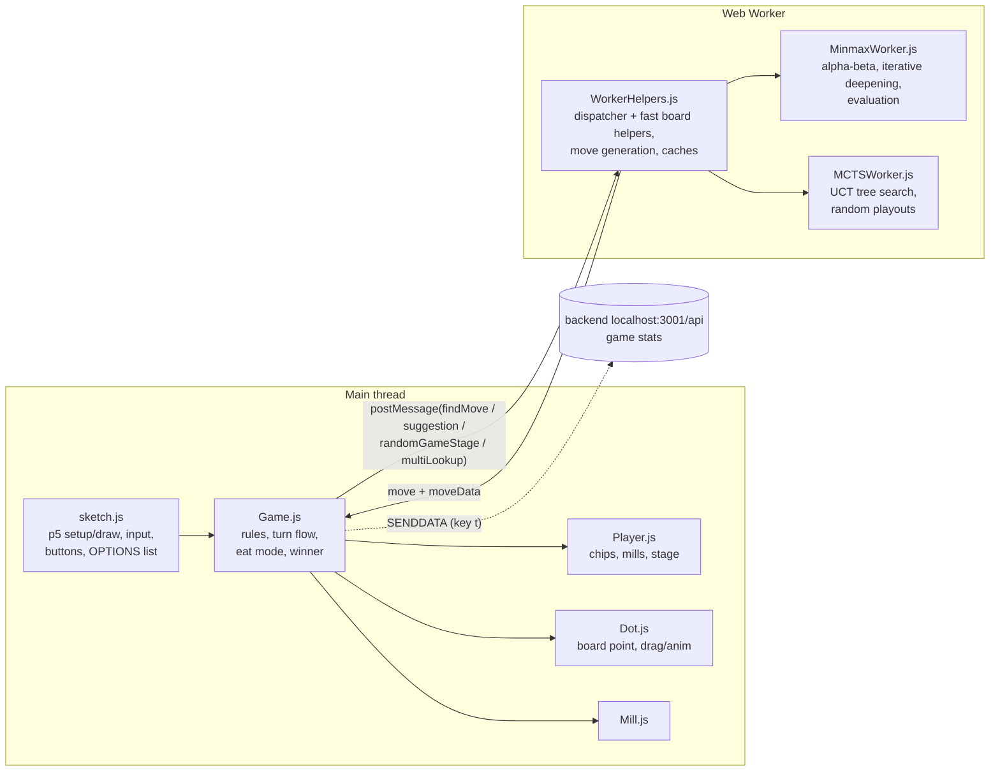

# Mills – overview

Nine Men's Morris (mylly) in the browser: p5.js for rendering and input, a Web Worker for the bots.
Plain scripts, no build step (loaded from `index.html` in order).

`classes/Worker.js` is an older, fully commented-out version of the bot code.

## Board and state

- Board = 24-char string, `'0'` empty, otherwise the player char. Index `layer*8 + i`
  (3 rings × 8 points); even indices are corners, odd ones the ring connectors.
- `millWindows` lists the 16 possible mills.
- Stage per player (`getStage`): 1 = placing (`chipsToAdd > 0`), 2 = moving,
  3 = flying (3 chips left). "Eat mode" (remove a chip after a mill) is handled as its own
  move type `eating`, and the same player moves again.
- Draw by threefold repetition (WMD): `Game.countPosition` counts board + player to move +
  both `chipsToAdd` after every completed turn (not in eat mode); the third occurrence calls
  `setDraw()` ("Draw!", Dark wood outline). A loss found in the same turn change comes first.
  `isOver()` is the game-over check (win or draw); `setState` starts a new count. The benchmark
  referee applies it too (ending `repetition`).
- The minimax bots know the rule: `findBestMove` sends `positionCounts`, the worker keeps them
  as `gameHistory`, and `fastMinimax` scores a third occurrence (history + search path,
  `repKey`) as a draw (0) unless it is won or lost; skipped while a player still places, since
  nothing can repeat then. Such path-dependent results are not stored in the transposition
  table. MCTS does not know the rule.

## Bots (OPTIONS in sketch.js)

| Option | What it does |
|---|---|
| Manual | Human player |
| Random | Random legal move |
| Minmax 1 / 4 / 6 | Fixed-depth alpha-beta |
| Iterative 0.5s … 10s | Iterative deepening with a time limit (max depth 15) |
| Iterative D 4 / D 6 | Iterative deepening to a fixed depth |
| MCTS | Monte Carlo tree search, 5000 iterations |

Both players' bot can be chosen separately, so bot-vs-bot autoplay is possible. Multi-lookup
(key `o`) runs several bots on the same position to compare their choices.

### Minimax (`MinmaxWorker.js`)

- Alpha-beta. An eating move does not reduce depth and keeps the same side moving.
- Win/loss = `±100 000 000 × depth`, so quicker wins score higher.
- Leaf evaluation is cached per board + stages (`boardEvaluationCache`); new-mill bonuses are
  added on top of the cached value, because "new mill" depends on history, not just the board.
- Move ordering: stage-specific generators put mill-related moves first; removable chips are sorted.
- Iterative deepening re-sorts the root moves by the previous depth's scores; a depth that
  runs out of time is thrown away.
- Ties are broken randomly (`RANDOMMOVES`), so bot-vs-bot games don't repeat.
- Transposition table (`ttTable`, per move search, cleared with the leaf cache): a position
  reached again by another move order reuses its score when searched to the same remaining depth
  (win scores scale with depth) and otherwise tries its best move first. The key (`ttKey`) is
  board, side, eat mode, chips to place and each mill's identity relative to the root (same
  mill or re-formed, new or not). Root and leaves are not touched; nothing is stored after the
  time limit cut a search. Same chosen-move score as without it (golden test);
  `TT_ENABLED = false` turns it off (tests only). Results: `bench/reports/mills-transposition-table/`
  (`iterative@d6` 63 % fewer leaves, about 2× faster; `iterative@1000ms` one ply deeper).

**Evaluation** (`fastNewEvaluateBoard` = own score − opponent score), hand-tuned weights per stage:

- Stage 1: mobility (neighbour count), mill 250, almost-mill 100, blocking opponent 400,
  "safe open mill" with the last chip 300.
- Stage 2/3: movable chips × 50, chips eaten × 1000, mill 1500, safe open mill 1500,
  double mill ("syhky") 3500, blocking / opponent mill stuck 400.
- New mill bonus: +3000 own, −4500 opponent (opponent weighted heavier = defensive).

### MCTS (`MCTSWorker.js`)

- UCT selection (`c = 1.41`), expand one unplayed move, random playout to the end, backprop.
- Transposition sharing: a node for an already-seen position copies its wins/visits (`nodesMap`).
- A position won for the bot is marked `wins = Infinity` (also for its parent).
- Final move = root child with the most visits.

## Other features

- Suggestion button / key `s`: asks the bot for a move for the human player.
- Random game state generator (key `p`, `getRandomGameState`): plays random moves to get
  a test position.
- Debug key `d`: prints where the evaluation score comes from (`scoreObject`).
- Keys: `h` lists all shortcuts.
- Optional backend (not in this folder) stores per-move timing and game results.

## Benchmark (`bench/`)

A Node-only tool that plays the real bot code (`workers/WorkerHelpers.js`, loaded unchanged
into a `vm` sandbox) against each other with a rules referee. The game page never loads it.

- Strength: `node Mills/bench/bench.js strength random minimax@d1 minimax@d4 --games 20 --jobs 4`
  plays every pairing, each seed once from each side, and reports Elo (`random` = 1000).
- Speed: `node Mills/bench/bench.js speed minimax@d4 iterative@500ms` times one move on each of
  the 40 fixed positions in `bench/positions.json`, per game stage.
- Bot names carry their budget: `@d<n>` depth, `@i<n>` iterations, `@<n>ms` time. Depth and
  iteration runs are repeatable on any machine; time-limited runs depend on the machine.
- Every run writes `<mode>-<timestamp>.{json,md,html}` to `bench/results/` (git-ignored, 10
  newest kept). `--save <name>` also stores it in `bench/reports/<name>/` (committed, with
  `COMMANDS.md`); `--compare <name>` shows the change against a saved run;
  `node Mills/bench/bench.js report <run.json> [--compare <name>]` rebuilds the HTML page.
- The recorded baseline is `bench/reports/baseline/` (fast strength run and speed run) plus
  `bench/reports/baseline-mcts/` (strength with MCTS, fewer games); the exact commands are in
  their `COMMANDS.md`. A milestone (after a few bot changes) re-runs them with
  `--compare baseline` / `--compare baseline-mcts` and saves as `--save milestone-<n>`. That
  full set takes about an hour; a single change uses the light check below.
- Light check per change: `node Mills/bench/bench.js speed <affected bots> --positions
  Mills/bench/positions-quick.json --save <change>-before` on the old code, the same with
  `--compare <change>-before` on the new code, plus the fast strength command
  (`random minimax@d1 minimax@d4 iterative@d4 --games 20 --seed 1 --cap 200 --jobs 4`) with
  `--compare baseline`. `positions-quick.json` is every fourth speed position (10).
- Tests: `node --test "Mills/bench/test/*.test.js"`.

## Known weak spots (at the time of writing, 2026-10)

- **MCTS:** wins are always counted for the bot, also at the opponent's nodes, so selection
  assumes the opponent helps the bot. Usually the result is flipped at every other level
  (negamax style).
- **MCTS:** the final choice compares `child[args]` (visits) against `maxWins = child.wins`,
  so the picked move is not reliably the most visited one.
- A January 2025 rewrite attempt (single shared worker, MCTS rewrite) is kept in
  `git stash` ("2025-01 AI experiments"). It is not part of the baseline, and its MCTS never ran playouts.
- **MCTS:** a fixed 5000 iterations, not a time limit, so it is hard to compare fairly
  against the timed minimax bots.
- Search state lives in globals (`startDepthNum`, `prevBestMoves`, …) shared by all bot
  types; it works now, but it is easy to break.
- The cached-value path (`getCalcedValue`) adds the new-mill bonuses with `else if` while a
  fresh evaluation counts both players' new mills; kept as is so the speed-up (below) changes no
  decision.

## Search speed (2026-10, `mills-minimax-speed`)

Move generation checks duplicates with a `Set`, players are copied with `clonePlayer` instead of
a JSON round trip, and neighbours, window ids and window counts are precomputed or done in one
pass. Fixed-depth bots decide exactly as before (checked by `bench/test/golden.test.js` and by
identical benchmark games); they are 1.6–1.9× faster, and the time-limited bots search about
twice as many positions. Numbers: `bench/reports/mills-minimax-speed/`. What remains is mostly
the evaluation itself.
