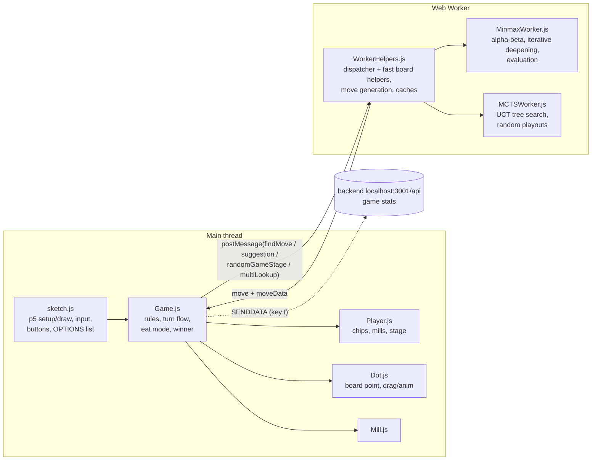

# Mills – overview

Nine Men's Morris (mylly) in the browser: p5.js for rendering and input, a Web Worker for the bots.
Plain scripts, no build step (loaded from `index.html` in order).

`classes/Worker.js` is an older, fully commented-out version of the bot code.

## Board and state

- Board = 24-char string, `'0'` empty, otherwise the player char. Index `layer*8 + i`
  (3 rings × 8 points); even indices are corners, odd ones the ring connectors.
- `millWindows` lists the 16 possible mills.
- Stage per player (`getStage`): 1 = placing (`chipsToAdd > 0`), 2 = moving,
  3 = flying (3 chips left). "Eat mode" (remove a chip after a mill) is handled as its own
  move type `eating`, and the same player moves again.
- Draw by threefold repetition (WMD): `Game.countPosition` counts board + player to move +
  both `chipsToAdd` after every completed turn (not in eat mode); the third occurrence calls
  `setDraw()` ("Draw!", Dark wood outline). A loss found in the same turn change comes first.
  `isOver()` is the game-over check (win or draw); `setState` starts a new count. The benchmark
  referee applies it too (ending `repetition`).
- The minimax bots know the rule: `findBestMove` sends `positionCounts`, the worker keeps them
  as `gameHistory`, and `fastMinimax` scores a third occurrence (history + search path,
  `repKey`) as a draw (0) unless it is won or lost; skipped while a player still places, since
  nothing can repeat then. Such path-dependent results are not stored in the transposition
  table. MCTS scores a third occurrence in its tree and playouts as a draw (0.5).

## Bots (OPTIONS in sketch.js)

| Option | What it does |
|---|---|
| Manual | Human player |
| Random | Random legal move |
| Minmax 1 / 4 / 6 | Fixed-depth alpha-beta |
| Iterative 0.5s … 10s | Iterative deepening with a time limit (max depth 15) |
| Iterative D 4 / D 6 | Iterative deepening to a fixed depth |
| MCTS | Monte Carlo tree search, 5000 iterations |

Both players' bot can be chosen separately, so bot-vs-bot autoplay is possible. Multi-lookup
(key `o`) runs several bots on the same position to compare their choices.

### Minimax (`MinmaxWorker.js`)

- Alpha-beta. An eating move does not reduce depth and keeps the same side moving.
- Win/loss = `±100 000 000 × depth`, so quicker wins score higher.
- Leaf evaluation is cached per board + stages (`boardEvaluationCache`); new-mill bonuses are
  added on top of the cached value, because "new mill" depends on history, not just the board.
- Move ordering: stage-specific generators put mill-related moves first; removable chips are sorted.
- Iterative deepening re-sorts the root moves by the previous depth's scores; a depth that
  runs out of time is thrown away.
- Ties are broken randomly (`RANDOMMOVES`), so bot-vs-bot games don't repeat.
- Transposition table (`ttTable`, per move search, cleared with the leaf cache): a position
  reached again by another move order reuses its score when searched to the same remaining depth
  (win scores scale with depth) and otherwise tries its best move first. The key (`ttKey`) is
  board, side, eat mode, chips to place and each mill's identity relative to the root (same
  mill or re-formed, new or not). Root and leaves are not touched; nothing is stored after the
  time limit cut a search. Same chosen-move score as without it (golden test);
  `TT_ENABLED = false` turns it off (tests only). Results: `bench/reports/mills-transposition-table/`
  (`iterative@d6` 63 % fewer leaves, about 2× faster; `iterative@1000ms` one ply deeper).

**Evaluation** (`fastNewEvaluateBoard` = own score − opponent score). Every weight comes from
`EVAL_WEIGHTS` at the top of `MinmaxWorker.js`; a search may override some with
`options.evalWeights` (only the benchmark does). Features (weight names in brackets):

- Stage 1: mobility per free neighbour (`placingNeighbour`), mill (`placingMill`), almost-mill
  (`placingAlmostMill`), blocking the opponent (`placingBlockOppMill`, `…Moving`), "safe open mill"
  with the last chip (`placingSafeOpenMill`), chips taken counted as material = on board + still
  to place (`chipTakenPlacing`).
- Stage 2/3: movable chips (`movableChip`), chips taken (`chipTaken`), mill, safe open mill,
  double mill ("syhky", `doubleMill`), blocks / opponent mill stuck. Stage 3 adds the flying
  threat: two own chips and an empty point in a line (`flyingThreat`).
- New mill bonus: own (`newMillOwn`) and opponent (`newMillOpp`, heavier = defensive). The cached
  leaf path adds the same bonuses, so cached = fresh (test in `bench/test/eval.test.js`).
- Weight sets (2026-10, `mills-eval-tuning`): `v0` = the 2021 hand weights (the golden test runs
  with it), `h1` = v0 + the two new terms, `t1` = SPSA-tuned from h1 (480 iterations at depth 3).
  **The default is t1** (= `bench/weights/v1.json`): 60.8 % against v0 at depth 4 (200 games,
  interval 53.8–67.3 %), 54.8 % at depth 2, 60.5 % against h1 at depth 4. The biggest change is
  mobility while placing (1 → 29 per free neighbour).

### MCTS (`MCTSWorker.js`)

Rewritten in 2026-10 (`mills-mcts-fix`); `MCTSFindBestMove` is the entry point.

- UCT selection (`c = 1.41`), expand one untried move (random order), random playout, backprop.
- A node's `value` sums rewards from the view of the player who moved into it (rewards: 1 win,
  0 loss, 0.5 draw for the root player), so each side picks its own best replies.
- Exact terminals: win/loss (`fastCheckWin`), no legal move (loss for the side to move), and a
  third occurrence of a position (`repKey` count 2 in `gameHistory`, after the placing stage) = draw.
- Playouts stop after 200 plies (`MCTS_PLAYOUT_CAP`) and count as a draw.
- Final move = root child with the most visits (ties: higher average value).
- `Node`, `playMove` and `generateRandomState` serve only the random game state generator.
- Tests: `bench/test/mcts.test.js` (immediate win, no mill given away, repeatable, generator).
- Milestone 1: Elo 1299 (was 1179), beats `minimax@d1` and `random` every game, still loses
  every game to the depth-4 bots. About 11 s per move (moving stage 2× faster than before;
  early placing slower, because the old search barely ran there).

## Other features

- Suggestion button / key `s`: asks the bot for a move for the human player.
- Random game state generator (key `p`, `getRandomGameState`): plays random moves to get
  a test position.
- Debug key `d`: prints where the evaluation score comes from (`scoreObject`).
- Keys: `h` lists all shortcuts.
- Optional backend (not in this folder) stores per-move timing and game results.

## Benchmark (`bench/`)

A Node-only tool that plays the real bot code (`workers/WorkerHelpers.js`, loaded unchanged
into a `vm` sandbox) against each other with a rules referee. The game page never loads it.

- Strength: `node Mills/bench/bench.js strength random minimax@d1 minimax@d4 --games 20 --jobs 4`
  plays every pairing, each seed once from each side, and reports Elo (`random` = 1000).
- Speed: `node Mills/bench/bench.js speed minimax@d4 iterative@500ms` times one move on each of
  the 40 fixed positions in `bench/positions.json`, per game stage.
- Bot names carry their budget: `@d<n>` depth, `@i<n>` iterations, `@<n>ms` time. Depth and
  iteration runs are repeatable on any machine; time-limited runs depend on the machine.
- Weight sets: a minimax/iterative name may end in `:<set>` (`minimax@d4:v0`), which searches
  with the evaluation weights in `bench/weights/<set>.json` (a partial or full object; unknown
  weight names are refused). The suffix stays in every report, so
  `strength minimax@d4:h1 minimax@d4:v0` plays two evaluations head-to-head. `v0` = the 2021
  weights, `h1` = v0 plus the hand fixes, `t1` = tuner output, `v1` = the accepted default.
- Tune: `node Mills/bench/bench.js tune --from h1 --depth 3 --iterations <n> --pairs 4 --seed 1
  --cap 200 --jobs 5 [--save <set>]` searches the weights by self-play (SPSA, `bench/tune.js`:
  ranges and steps in `TUNABLE`). Each iteration plays `minimax@d<depth>` θ+ vs θ−, each seed
  from both sides after 4 random opening plies. Same arguments → same weights, whatever the job
  count. Progress goes to stderr; `bench/results/tune-<seed>.json` (git-ignored) is written after
  every iteration, and `--resume` continues it (the arguments must match; `--iterations` may grow).
  `--save <set>` writes the final weights to `bench/weights/<set>.json`.
- Every run writes `<mode>-<timestamp>.{json,md,html}` to `bench/results/` (git-ignored, 10
  newest kept). `--save <name>` also stores it in `bench/reports/<name>/` (committed, with
  `COMMANDS.md`); `--compare <name>` shows the change against a saved run;
  `node Mills/bench/bench.js report <run.json> [--compare <name>]` rebuilds the HTML page.
- The recorded baseline is `bench/reports/baseline/` (fast strength run and speed run) plus
  `bench/reports/baseline-mcts/` (strength with MCTS, fewer games); the exact commands are in
  their `COMMANDS.md`. A milestone (after a few bot changes) re-runs them with
  `--compare baseline` / `--compare baseline-mcts` and saves as `--save milestone-<n>`. That
  full set takes about an hour; a single change uses the light check below. Latest:
  `bench/reports/milestone-1/` and `milestone-1-mcts/` (results in the archived
  `mills-mcts-fix` design).
- Light check per change: `node Mills/bench/bench.js speed <affected bots> --positions
  Mills/bench/positions-quick.json --save <change>-before` on the old code, the same with
  `--compare <change>-before` on the new code, plus the fast strength command
  (`random minimax@d1 minimax@d4 iterative@d4 --games 20 --seed 1 --cap 200 --jobs 4`) with
  `--compare baseline`. `positions-quick.json` is every fourth speed position (10).
- Tests: `node --test "Mills/bench/test/*.test.js"`.

## Known weak spots (at the time of writing, 2026-10)

- **MCTS:** playouts are purely random, which is weak in Mills; evaluation-guided playouts or
  a time budget are possible next steps. The tree is not reused between moves. Early placing
  takes about 14 s per move (playouts run to the 200-ply cap).
- A January 2025 rewrite attempt (single shared worker, MCTS rewrite) is kept in
  `git stash` ("2025-01 AI experiments"). It is not part of the baseline, and its MCTS never ran playouts.
- **MCTS:** a fixed 5000 iterations, not a time limit, so it is hard to compare fairly
  against the timed minimax bots.
- Search state lives in globals (`startDepthNum`, `prevBestMoves`, …) shared by all bot
  types; it works now, but it is easy to break.
- **Evaluation:** the SPSA run's per-iteration signal stayed near zero (8 games per iteration),
  so t1 is one noisy step, not an optimum; more games per iteration or a second run from t1
  could gain more. While moving, chips taken compare chips on board only, so in the turn where
  the opponent places its last chip the term is off by one (kept: it is what v0 does).

## Search speed (2026-10, `mills-minimax-speed`)

Move generation checks duplicates with a `Set`, players are copied with `clonePlayer` instead of
a JSON round trip, and neighbours, window ids and window counts are precomputed or done in one
pass. Fixed-depth bots decide exactly as before (checked by `bench/test/golden.test.js` and by
identical benchmark games); they are 1.6–1.9× faster, and the time-limited bots search about
twice as many positions. Numbers: `bench/reports/mills-minimax-speed/`. What remains is mostly
the evaluation itself.
