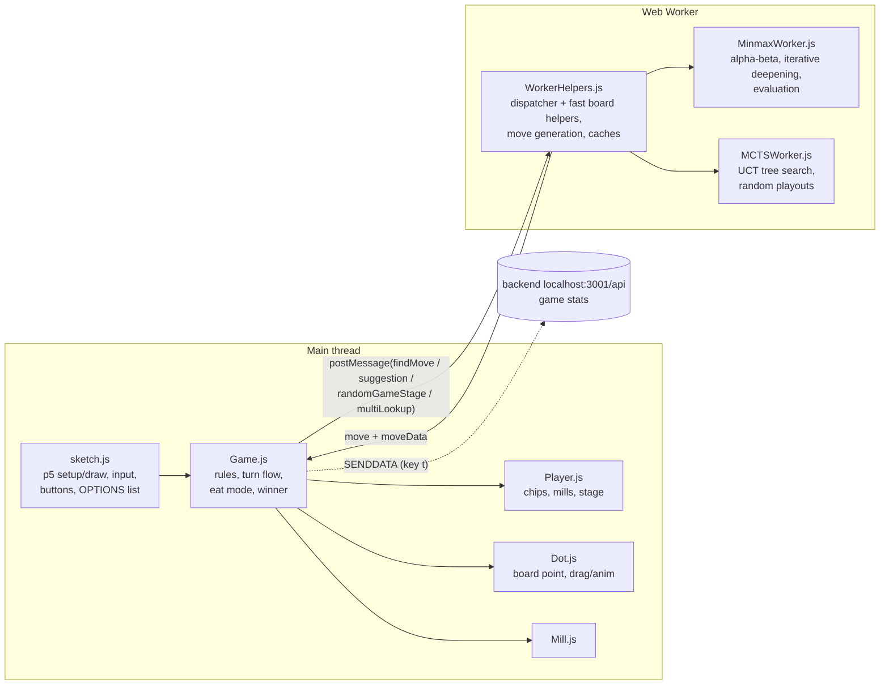

# Mills – overview

Nine Men's Morris (mylly) in the browser: p5.js for rendering and input, a Web Worker for the bots.
Plain scripts, no build step (loaded from `index.html` in order).

`classes/Worker.js` is an older, fully commented-out version of the bot code.

## Board and state

- Board = 24-char string, `'0'` empty, otherwise the player char. Index `layer*8 + i`
  (3 rings × 8 points); even indices are corners, odd ones the ring connectors.
- `millWindows` lists the 16 possible mills.
- Stage per player (`getStage`): 1 = placing (`chipsToAdd > 0`), 2 = moving,
  3 = flying (3 chips left). "Eat mode" (remove a chip after a mill) is handled as its own
  move type `eating`, and the same player moves again.

## Bots (OPTIONS in sketch.js)

| Option | What it does |
|---|---|
| Manual | Human player |
| Random | Random legal move |
| Minmax 1 / 4 / 6 | Fixed-depth alpha-beta |
| Iterative 0.5s … 10s | Iterative deepening with a time limit (max depth 15) |
| Iterative D 4 / D 6 | Iterative deepening to a fixed depth |
| MCTS | Monte Carlo tree search, 5000 iterations |

Both players' bot can be chosen separately, so bot-vs-bot autoplay is possible. Multi-lookup
(key `o`) runs several bots on the same position to compare their choices.

### Minimax (`MinmaxWorker.js`)

- Alpha-beta. An eating move does not reduce depth and keeps the same side moving.
- Win/loss = `±100 000 000 × depth`, so quicker wins score higher.
- Leaf evaluation is cached per board + stages (`boardEvaluationCache`); new-mill bonuses are
  added on top of the cached value, because "new mill" depends on history, not just the board.
- Move ordering: stage-specific generators put mill-related moves first; removable chips are sorted.
- Iterative deepening re-sorts the root moves by the previous depth's scores; a depth that
  runs out of time is thrown away.
- Ties are broken randomly (`RANDOMMOVES`), so bot-vs-bot games don't repeat.

**Evaluation** (`fastNewEvaluateBoard` = own score − opponent score), hand-tuned weights per stage:

- Stage 1: mobility (neighbour count), mill 250, almost-mill 100, blocking opponent 400,
  "safe open mill" with the last chip 300.
- Stage 2/3: movable chips × 50, chips eaten × 1000, mill 1500, safe open mill 1500,
  double mill ("syhky") 3500, blocking / opponent mill stuck 400.
- New mill bonus: +3000 own, −4500 opponent (opponent weighted heavier = defensive).

### MCTS (`MCTSWorker.js`)

- UCT selection (`c = 1.41`), expand one unplayed move, random playout to the end, backprop.
- Transposition sharing: a node for an already-seen position copies its wins/visits (`nodesMap`).
- A position won for the bot is marked `wins = Infinity` (also for its parent).
- Final move = root child with the most visits.

## Other features

- Suggestion button / key `s`: asks the bot for a move for the human player.
- Random game state generator (key `p`, `getRandomGameState`): plays random moves to get
  a test position.
- Debug key `d`: prints where the evaluation score comes from (`scoreObject`).
- Keys: `h` lists all shortcuts.
- Optional backend (not in this folder) stores per-move timing and game results.

## Known weak spots (at the time of writing, 2026-10)

- **MCTS:** wins are always counted for the bot, also at the opponent's nodes, so selection
  assumes the opponent helps the bot. Usually the result is flipped at every other level
  (negamax style).
- **MCTS:** the final choice compares `child[args]` (visits) against `maxWins = child.wins`,
  so the picked move is not reliably the most visited one.
- A January 2025 rewrite attempt (single shared worker, MCTS rewrite) is kept in
  `git stash` ("2025-01 AI experiments"). It is not part of the baseline, and its MCTS never ran playouts.
- **MCTS:** a fixed 5000 iterations, not a time limit, so it is hard to compare fairly
  against the timed minimax bots.
- Search state lives in globals (`startDepthNum`, `prevBestMoves`, …) shared by all bot
  types; it works now, but it is easy to break.
- Players are cloned with `JSON.parse(JSON.stringify())` at every node; this is likely the
  biggest speed cost in minimax.
